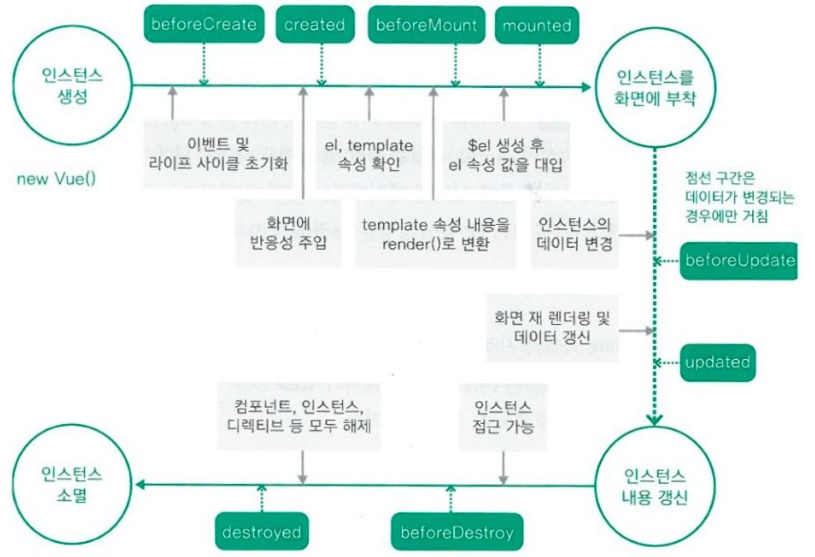

#Vue 기본 정리 

```javascript
    //vue의 기본 구조는 (CDN으로 불렀을 경우)
    
    const app = new Vue({
        el:`vue가 들어갈 rootId _ #까지 붙여서`,
        data:{
            //데이터
            key1 : value1,
            key2 : value2
        },methods :{
            //메소드
            onMethods(){
                
            }
        }
        
    })
    //가 되며    
```

```html
    <!doctype html>
    <html lang="en">
    <head>
        <meta charset="UTF-8">
        <meta name="viewport"
              content="width=device-width, user-scalable=no, initial-scale=1.0, maximum-scale=1.0, minimum-scale=1.0">
        <meta http-equiv="X-UA-Compatible" content="ie=edge">
        <title>Document</title>
    </head>
    <body>
        <div id="root">
            <!--  이 안에 vue 코드를 사용하면 html 태그를 vue로 렌더링 하는 식-->
            <div v-if="데이터"> html 태그 내용 </div>
            <button v-else v-on:click="메소드"> html 태그 내용 || {{vue의 data || JS}}  </button> 
            <!--** 
                vue에서 데이터 바인딩의 가장 기본적인 형태는 Mustache 구문이다.
                
                'v-' 접두가사 있으면 특수 속성이다. 
                 **v-model** 은 vue의 data에 대응되며 v-model의 데이터가 바뀌면 자동으로 뷰 데이터와 연동된다.
                 **v-bind** 역시 vue의 데이터와 바인딩해주지만,
                  **v-model과의 차이점은 v-model은 양방향 바인딩 / v-bind는 단방향 바인딩이라는 것이다.** 
                 
                 
             -->
            <!--
                와 같은 식으로 작성한다.  Vue는 데이터 중심으로 돌아간다.
                즉, 화면은 처음에 다 만들어놓고 데이터만 바뀐다는 마인드로 접근해야한다. 
                
                추가적으로 데이터가 반복되는 부분은 컴포넌트로 만들어서 반복되는 부분을 줄일 수 있다.
            -->
        </div>
    </body>
</html>
```

추가적으로 컴포넌트를 등록해서 사용하거나 vue의 <script></script> 안에서 template으로 
vue 엔진을 통해서 html을 렌더링할 수도 있다. 


```html
    <script>
        const app = new Vue({
            el:"#root",
        })
    </script>
    <script>
        Vue.component('componentName',{
            template:{
                //html을 렌더링한다. 
        
                <div>//vue는 단일 root를 가지고 있어야한다. 
                    <div>{{data}}</div>
                    <form v-on:submit="methodsName"}>
                        <input type="text" v-model="value" ref = "answer"}/>
                        //ref는 레퍼런스 ID를 자식 컴포넌트나 HTML요소에 부여함으로써 직접 접근할 수 있게 해준다. 
                    // 직접 접근은 this.$ref.ref이름으로 진행된다. 
                        <button type="submit"> btn </button>
                    </form>
                </div>
            },
            props:{
                    // 부모 컴포넌트로부터 받은 데이터를 props에서 받아서 사용한다.
            },
            methods:{
                    methodsName(e){
                        e.preventDefault() //html의 기본 동작을 막는다. 
                }
            }
        })
    </script>
    
    
```


---
###1.2 WEBPACK의 사용
````
 기존의 방법대로 진행해도 좋지만 
 webpack을 이용하면 JS를 파일 단위로 모듈 관리를 할 수 있으며,
 여러 전처리 등을 사용할 수 있어 한결 수월해진다.
  
    
````
---- webpack.config.js ----
````javascript


const VueLoaderPlugin = require('vue-loader/lib/plugin')
const path = require('path');
//node 환경에서는 require를 쓴다고 그냥 일단 생각

//이건 node의 모듈 시스템 >> import/export 대신에 require


module.exports = {
    mode:'development',//'production'
    devtool :'eval', // hidden-source-map >> webpack build속도가 빠름,
    resolve:{  //Resolving 정책
        extensions:['.js','.vue'], //여기에 넣어주면 main에서 import할 때 확장자를 제거할 수 있다.
    },
    //node의 모듈을 만들었다.
    //webpack == script가 너무 많아서 그걸 하나로 합치려고 쓴다.
    entry:{
        app: path.join(__dirname,'index.js'),
        //app은 하나로 합쳐질 이름
    },
    module:{
        //webpack의 핵심 >> 읽어내려가다 문제가 생기면 module을 참고하여 처리


        rules:[{
            //    어떻게 합치고 어떻게 처리할 건지?
            test:/\.vue$/,
            loader:'vue-loader',

        },{
            test:/\.css$/,
            use:['vue-style-loader',
                'css-loader',]

        }],


    },
    plugins:[
        new VueLoaderPlugin(),
        //module을 만나다 최종 처리가 필요할 때
    ],
    output:{
        filename: 'app.js',
        path: path.join(__dirname, "dist"),
        publicPath :"/dist"

}

};

````

` 위와 같이 설정하면 dist에 app.js라는 이름으로 각 js들이 렌더링되고 


````javascript
    import Vue from 'vue'; //vue import
    import Vue파일 from './위치'; // 상대경로
    new Vue(Vue파일).$mount("#root");
// el:~~ 의 역할을 한다.
// 위와 같이 작성하고 html에서 <script scr="">으로 가져오면
// root에 vue가 렌더링되는 식이다. 

````

결과적으로 HTML로 반환된다. 추가적으로 maven과 유사한? npm을 이용하여 pom.xml과 유사하게 package.json으로 dependency 및 build 관리를 할 수 있다.


```json
    {
          "name": "response",
          "version": "1.0.0",
          "description": "",
          "main": "index.js",
          "scripts": {
                "build": "webpack --watch",
                "dev": "webpack-dev-server --config webpack.config.js --live-reload"
          },
              "author": "",
              "license": "ISC",
              "dependencies": {
                "vue": "^2.6.14",
                "vue-template-compiler": "^2.6.14"
          },
          "devDependencies": {
                "css-loader": "^6.5.0",
                "vue-loader": "^15.9.8",
                "vue-style-loader": "^4.1.3",
                "webpack": "^5.60.0",
                "webpack-cli": "^4.9.1",
                "webpack-dev-server": "^4.4.0"
          }
    }
```


//`4. 반응 속도 테스트`에서 사용한 vue템플릿으로 전체적인 템플릿 다시보기
```vue

<!--js가 아닌애-->
<template>
     <div>
          <div id = "screen" v-bind:class="state" @click="onClickScreen">{{message}}</div>
          <!--
              v-bind >> ":"
              :를 붙이면 데이터를 자바스크립트에서 사용할 수 있다.
          -->
          <template v-if="result.length">
               <!--
                         display: none;   >> v-show가 false이면 display :none
                         v-if와의 차이점? v-if인 경우는 <`!----`>처리가 된다. >>아예 태그 자체가 존재하지 않는 상태로 된다. >> 레이아웃에 영향을 끼친다.
               
                         >> v-if를 쓰면 v-else, v-else-if를 사용할 수 있다.
               
                         ++ 추가적으로 위의 div는 그냥 감싸주려고 사용하는건데 >> 만약 그냥 div를 쓰기는 싫은데 v-show는 쓰고 싶으면 template로 감싸주면 div없이 유사한 효과를 낼 수 있다.
                         추가적으로 최상위는 template으로 쓰지 못한다.(즉, template, template 최상위 / 차상위 X)
               -->

               <!--          <div>평균 시간 :{{result.reduce((a,c)=>a+c,0)/result.length || 0}}ms</div>-->
               <div>평균 시간 :{{average}}ms</div>
               <button @click ="onReset">리셋</button>
          </template>

     </div>
</template>


<script>
let startTime = 0;
let endTime = 0;
let timeOut = null;


export default {
     //export default로 해당 컴포넌트를 바깥으로 뺴낼 수 있다. 
     data(){
          //vue에서 사용하는 데이터를 가지고 있는다. (함수 형식)
          return{
               result :[],
               state : 'waiting',
               //클래스를 나타낼 데이터
               message : '클릭해서 시작하세요'
          }

     },
     computed:{
          // 일반 데이터를 가공하여 사용할 때 computed를 사용한다. 
          // computed는 캐싱되어 계산 결과를 여러 번 사용할 때 유리하다. 
          // data와 마찬가지로 return으로 반환한다. 
          average(){
               return this.result.reduce((a,c)=>a+c,0)/this.result.length || 0;
               //computed는 일반 데이터를 가공해서 사용할 때 computped를 사용한다.
               //computed로 계산한 값은 캐싱이된다.
               /*
                 만약! result그대로인데 message가 바뀌면 template가 재렌더 되고 result 계산은 재실행되면서 재연산한다. >> 굳이 그럴 필요가 없다. (계산이 복잡해지면 문제가 생긴다. )
                 이런 상황에서 computed로 해놓으면 그릴 때 이미 캐싱된 녀석을 가져다 사용하면 된다.  >> 결국 성능상의 문제와 관계가 있기 때문에
                 vue에서는 성능 최적화가 엄청나게 신경쓸 필요까지는 없는데 챙기고 가야할 부분이기 때문이다.
                */
          }
     },
     methods:{
          // 메소드들을 작성한다. 여기서 화살표함수는 this를 사용할 수 없으므로 사용하면 안된다. 
          onReset(){
               this.result =[];
          },
          onClickScreen(){
               if(this.state=='waiting'){
                    this.state='ready';
                    this.message = "초록색이 되면 클릭하세요"
                    timeOut = setTimeout(()=>{
                         this.state = 'now';
                         this.message = "지금 클릭"
                         startTime = new Date();

                    }, Math.floor(Math.random()*1000)+2000);
               } else if( this.state==='ready'){

                    clearTimeout(timeOut);

                    this.state = "waiting"
                    this.message = "너무 빠르게 눌렀습니다. "
               } else if( this.state==='now'){
                    endTime = new Date();
                    this.state = "waiting"
                    this.message = "클릭해서 시작하세요."
                    this.result.push(endTime - startTime);

               }
          },

     },
     props:{
          //부모의 데이터를 받아오며, props는 바꿀 수 없다. (readOnly)
          // 받아온 변수명 : 데이터 형식으로 작성하며 더 자세히 쓸 수 있다. 
     },
     watch:{
          // 바뀐 데이터를 감지해서 바뀐 데이터가 있으면 실행된다. 
          //데이터 키값과 같은 이름
          watchData(value, oldValue){
               /*
                    value는 바뀐 데이터, oldValue는 바뀌기 전 데이터이다.
                    만약 watch하는 데이터가 객체라면 참조 값이기 때문에 바뀌지 전후가 같을 수 있다. 
                    primitive는 괜찮다.
                    
                    
                    >> 하지만 watch를 사용하면 바뀐 데이터를 다시 watch하면서 무한루프에 빠질 수도 있다.
                    >> 또한, watch가 비동기로 동작하기 때문에 바뀐 것을 tracking하기 어렵다. 
                */
          }
     }
};
</script>


<style scoped>
/*
scoped를 붙일 수 있다.
컴포넌트마다 css가 달라지는데 css는 컴포넌트를 넘나들 수 있다.
그럴 때, 나는 이 컴포넌트 안에서만 이 CSS를 사용하고 싶으면 'scoped'를 붙여서 이를 방지할 수 있다.
data-v-22c711e와 같이 태그에 부가적으로 붙여서 고유하게 만들어준다.
*/
#screen{
     width: 300px;
     height: 200px;
     text-align: center;
     user-select: none;
}
#screen.waiting{
     background-color: aqua;
}
#screen.ready{
     background-color: red;
     color:white;
}
#screen.now{
     background-color: greenyellow;
}

</style>

```


---
###1.3 vue의 생명주기


```javascript
     export default {
            //라이프 사이클 훅
            beforeCreated(){
                // 인스턴스가 초기화 된 직후, 데이터 관찰 및 이벤트/감시자(watcher) 설정 전에 동기적으로 호출
            },
            created(){
                // 인스턴스가 생성된 후 동기적으로 호출, 
                // 인스턴스는 data관찰, computed속성, methodsj, watch/이벤트 콜백 등의 설정이 준비되었음을 의미하는 옵션처리를 완료
                // 그러나 마운트가 되지 않았으므로 $el 속성을 사용할 수 없음
            },
            beforeMount() {
                // 마운트가 시작되기 직전 [render]함수가 처음으로 호출된다.
                // ~ 서버 사이드 렌더링 중 호출되지 않는다. 
            },
            mounted(){
                // 인스턴스가 마운트 된 후 호출되며, vue.createApp({}).mount()로 전달된 엘리먼트는 새로 생성된 vm.$el로 대체된다.
                // 루트 인스턴스가 문서 내의 엘리멘트에 마운트되어 있으면, mount가 호출될 떄 vm.$el도 문서에 포함(in-document)된다.
                
                // mounted는 모든 자식 컴포넌트가 마운트되었음을 보장지 않는다. 
                //전체 화면 내용이 렌더링될 때까지 기다리려면 mounted내에서 vm.$nextTick을 사용하면 된다.
                
                this.$nextTick(function(){
                    //전체 화면 내용이 렌더링 된 후에 코드가 실행된다. 
                })
                
                // ~ 서버 사이드 렌더링 중 호출되지 않는다. 
            },
            beforeUpdate() {
                // DOM이 패치되기 전에 데이터가 변경될 떄 호출된다. 이 훅은 업뎁이트 전에 기존 DOM에 접근하기에 용이한 시점이다.
                // (수동으로 추가된 이벤트 리스너를 제거하는 경우와 같은 예시)
                
                //    ~초기 렌더링만 서버측에서 수행되기 떄문에, 이 훅은 서버측 렌더링 중 호출되지 않는다. 
            },
            updated(){
                // 데이터가 변경되어 가상 DOM이 다시 렌더링되고 패치된 후에 호출된다.
                // updated가 호출될 떄 컴포넌트의 DOM이 업데이트 되므로, 
                // 여기에서 DOM의 종속적인 연산(DOM-dependent operations)을 할 수 없다.
                // 그러나 대부분의 경우 훅 내부에서 상태를 변경하지 않아야한다.
                //    
                // 상태 변경에 반응하기 위해서 일반적으로 computed나 watcher를 이용하는 것을 권장한다.
                
                // updated 역시 하위 컴포넌트의 렌더링을 보장하려면
                this.$nextTick(function (){
                    //전체 화면 내용이 다시 렌더링된 후에 코드가 실행된다. 
                })
                
                    
                
            },
            beforeUnmount() {
                // beforeDestory아님
                // 컴포넌트 인스턴스가 마운드 해제(unmounted)되기 직전에 호출된다. 이 단계에서는 인스턴스는 여전히 완벽하게 작동된다.
                
                
                // ~ 이 훅은 서버층 렌더링 중 호출되지 않는다. 
                
            },
            unMounted(){
                // destoryed아님
                // 컴포넌트 인스턴스가 마운트 해제(unMounted)된 후 호출된다. 이 훅이 호출되면 컴포넌트 인스턴스의 모든 디렉티브가 바인딩 해제되고, 
                // 모든 이벤트 리스너가 제거되며, 모든 자식 컴포넌트도 마운트 해제된다.(cascade)
                
                // ~이 훅은 서버측 렌더링 중 호출되지 않는다. 
            },
    
    
    
    
            //이 외에 [[vue document _ 라이프사이클 훅]](https://v3.ko.vuejs.org/api/options-lifecycle-hooks.html#errorcaptured)을 참고하면
            errorCaptured(){
                //타입 (err: Error, instance : Component, info:string) => ?boolean
                
                // 자손 컴포너트의 에러가 포착(capture)될 때 호출된다.
                // 이 훅은 세 가지 전달인자(에러, 에러를 발생시킨 컴포넌트 인스턴스, 에러가 포착된 위치에 대한 정보가 들어있는 문자열)
                // 를 받는다. 이 훅은 false를 반환밯여 에러가 전파되지 않도록 할 수도 있다.
                
                
                // > TIP 
                //      이 훅에서 컴포넌트 상태를 수정할 수 있다. 하지만 에러가 포착되었을 때, 템플릿이나 렌더 함수 안에서 다른 내용을
                //      더 이상 실행시키지 않는 조건을 가지는 것이 중요하다. 그렇지 않으면 컴포넌트가 무한 루프에 빠질 수도 있다.   
                
                // 에러 전파 규칙: 
                //  기본적으로 모든 에러는 정의된 경우에 전역 config.errorHandler로 보내진다.
                //  여러 개의 errorCaptured 훅들이 컴포넌트의 상속 체인이나 부모 체인에 존재하면, 모두 동일한 에러로 호출된다.
                //  errorCaptured 훅 자체에서 에러가 발생하면, 이 에러와 원래 포착된 에러가 모두 전역 config.errorHandler로 보내진다.
                //  errorCaptured 훅은 에러가 더 전파되지 않도록 false를 반환할 수 있다. 이는 본질적으로 
                //      " 이 에러는 처리되었으므로 무시해야한다" 는 의미를 담고 있다.
                //  이 에러에 대해 어떠한 추가적인 errorCaptured 훅이나 전역 config.errorHandler가 호출되지 않도록 한다.                
            },
            
            renderTracked(){
                // 타입(e: DebuggerEvent) => void
                
                //가상 DOM의 재렌더링이 추적될 때 호출된다. 이 훅은 debugger Event를 전달인자로 받는다.  이 이벤트는 어떤 작업이
                //컴포넌트를 추적했는지와 해당 작업의 대상 객체 및 키를 알려준다. 
            }
    
            
            
     }
     
```
```vue
<!--           renderTracked 예시          -->
     <template>

        <div id="app">
            <button v-on:click="addToCart">Add to cart</button>
             <p>Cart({{car}})</p>
        </div>
     </template>
     <script>
          export default {
               data(){
                    return { 
                         cart:0
                    }
               },
               renderTracked({key, target, type}){
                    console.log({key,target, type});
                    // 컴포넌트가 최초로 렌더링 될 때 출력
                    
                    /*
                          {
                              key: "cart",
                              target: {
                                cart: 0
                              },
                              type: "get"
                          }
                    */
               },
               methods:{
                    addToCart(){
                         this.cart +=1
                    }
               }
          }
     </script>
```
```javascript
    export default{
    

        renderTriggered(){
            // 타입 (e:DebuggerEvent) => void
            
            // 가상 돔의 재렌더링이 트리거 될 때 호출된다. renderTracked와 유사하게 debugger even를 전달인자로 받는다. 
            // 이 이벤트는 어떤 작업이 재렌더링을 트리거한 해당 작업의 대상 객체 및 키를 알려준다.  
        }
    } 
```
```vue
               <!--renderTriggered 예시-->
    <template>
          <div  id="app">
               <button v-on:click="addToCart">Add to Cart</button>
               <p>Cart({{cart}})</p>
          </div>
     </template>
     <script>
          export default  {
               data(){
                    return{
                         cart:0,
                    }
               },
               renderTriggered({key, target, type}){
                    console.log({key, target, type})
               },
               methods:{
                    addToCart() {
                         this.cart += 1
                         /* renderTriggered 호출이 발생합니다
                           {
                             key: "cart",
                             target: {
                               cart: 1
                             },
                             type: "set"
                           }
                         */
                    }
               }
          }
     </script>
```


* 추가적인 이슈로 vue에서 자식 컴포넌트가 부모 컴포넌트의 `data(){}`에 접근하려면 `$root.$data`로 접근할 수 있다. 또한 부모 컴포넌트의 data를 바꿀 수도 있다. 
```javascript
//$root.$data로 접근
    this.$root.$data.turn = this.$root.$data.turn === 'O'? 'X':'O';
```
* vue에서는 객체나 배열을 key, index로 접근하면 렌더링이 되지 않으며 데이터는 바뀌지만 화면은 다시 그려지지 않는 상황이 발생한다. 
* 재렌더를 발생시키려면 vue.set()혹은 this.$set으로 변경해야한다.
 ```javascript
//this.$set
    this.$set(this.$root.$data.tableData[this.rowIndx], this.cellIndex, rootData.turn);
                                             대상      ,   인덱스       , 값
```